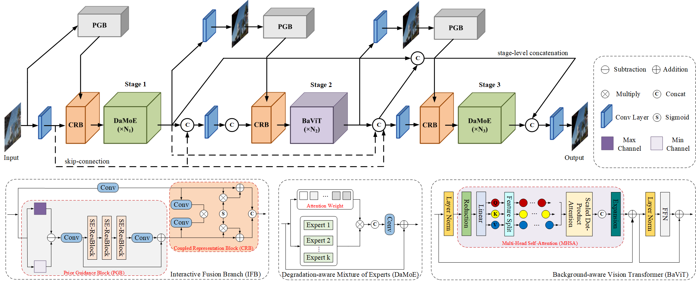

# Hybrid CNN-Transformer Feature Fusion for Single Image Deraining

Xiang Chen, Jinshan Pan, Jiyang Lu, Zhentao Fan, Hao Li

<hr />

> **Abstract:** *Since rain streaks exhibit diverse geometric appearances and irregular overlapped phenomena, these complex characteristics challenge the design of an effective single image deraining model. To this end, rich local-global information representations are increasingly indispensable for better satisfying rain removal.  In this paper, we propose a lightweight Hybrid CNN-Transformer Feature Fusion Network (dubbed as HCT-FFN) in a stage-by-stage progressive manner, which can harmonize these two architectures to help image restoration by leveraging their individual learning strengths. Specifically, we stack a sequence of the degradation-aware mixture of experts (DaMoE) modules in the CNN-based stage, where appropriate local experts adaptively enable the model to emphasize spatially-varying rain distribution features. As for the Transformer-based stage, a background-aware vision Transformer (BaViT) module is employed to complement spatially-long feature dependencies of images, so as to achieve global texture recovery while preserving the required structure.  Considering the indeterminate knowledge discrepancy among CNN features and Transformer features, we introduce an interactive fusion branch at adjacent stages to further facilitate the reconstruction of high-quality deraining results. Extensive evaluations show the effectiveness and extensibility of our developed HCT-FFN.* 
<hr />

## Network Architecture

 

## Installation
* PyTorch == 0.4.1
* torchvision == 0.2.0
* Python == 3.6.0
* imageio == 2.5.0
* numpy == 1.14.0
* opencv-python
* scikit-image == 0.13.0
* tqdm == 4.32.2
* scipy == 1.2.1
* matplotlib == 3.1.1
* ipython == 7.6.1
* h5py == 2.10.0

## Training
1. Modify data path in code/data/rainheavy.py and code/data/rainheavytest.py <br/>
datapath/data/\*\*\*.png <br/>
datapath/label/\*\*\*.png

2. Begining Training:
```
$ cd ./code/
$ python main.py --save HCT-FFN --model hct-ffn --scale 2 --epochs 400 --batch_size 4 --patch_size 128 --data_train RainHeavy --n_threads 0 --data_test RainHeavyTest --data_range 1-1800/1-100 --loss 1*MSE+0.2*SSIM  --save_results --lr 1e-4 --n_feats 32 --n_resblocks 3
```

## Testing
```
$ cd ./code/
$ python main.py --data_test RainHeavyTest  --ext img --scale 2  --data_range 1-1800/1-100 --pre_train ../experiment/HCT-FFN/model/model_best.pt --model hct-ffn --test_only --save_results --save HCT-FFN_test
```
The pre-trained models are available at ./experiment/HCT-FFN/model/.

## Derained Results
If needed, please download from [Google Drive](https://drive.google.com/file/d/1La0CJWfVgCIXi8HoKhs5OcxTdcdjZkS4/view?usp=sharing).

## Extension to Image Dehazing | Dehazed Results
If needed, please download from [Google Drive](https://drive.google.com/file/d/1Hf73ojw47Qj15gYjfkAT1LTumCco11ME/view?usp=sharing).

## Performance Evaluation

All PSNR and SSIM results are computed by using this [Matlab Code](https://github.com/hongwang01/RCDNet/tree/master/Performance_evaluation), based on Y channel of YCbCr space.

## Citation
If you are interested in this work, please consider citing:

    @inproceedings{chen2023hybrid,
        title={Hybrid CNN-Transformer Feature Fusion for Single Image Deraining}, 
        author={Chen, Xiang and Pan, Jinshan and Lu, Jiyang and Fan, Zhentao and Li, Hao},
        booktitle={AAAI},
        year={2023}
    }

## Acknowledgment
This code is based on the [SPDNet](https://github.com/Joyies/SPDNet). Thanks for sharing !
